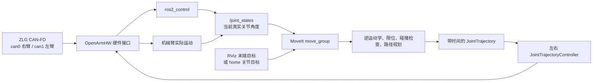

# 双臂运动规划与远程显示操作指南

本文适用于当前双臂系统：

- 右臂使用 `can0`；
- 左臂使用 `can1`；
- 两路均为 CAN-FD，仲裁速率 1 Mbps、数据速率 5 Mbps；
- ROS 2 运行在 NUC Linux 主机，MoveIt/RViz 可显示到 Windows 的 XLaunch。

> **安全提示**：以下“启动真实硬件”“Execute”“直接发送关节命令”都会使机械臂运动或使能。执行前确认机械臂活动范围内无人、夹爪未夹持危险物体，并确保急停或断电方式可立即使用。每次只启动一套 ROS 控制程序。

## 1. 运动规划整体流程



1. **CAN 初始化**：ZLG 驱动创建并配置 `can0`、`can1`。
2. **硬件读取**：`OpenArmHW` 从电机读取编码器数据。
3. **状态发布**：`ros2_control` 发布 `/joint_states`，这是规划的真实起点。
4. **目标设置**：在 RViz 中拖动末端交互标记，或选择预设的 `home`。
5. **MoveIt 规划**：检查关节限位、当前状态、碰撞和逆运动学，生成无碰撞路径。
6. **轨迹执行**：MoveIt 将轨迹交给左右轨迹控制器，再由硬件接口通过 CAN 下发给电机。
7. **闭环反馈**：实际关节状态持续反馈；通信异常、轨迹误差过大或急停时应中止。

对于末端拖动规划，应使用 `right_arm` 或 `left_arm`。`upper_body` 是双臂组合组，不是单条运动链，不适合做末端交互逆运动学。

## 2. Linux 主机：准备与启动命令

以下命令在 NUC 的 Linux 终端中执行。

### 2.1 加载 ROS 环境

```bash
source /opt/ros/humble/setup.bash
source ~/ros2_ws/install/setup.bash
```

功能说明：

- 第一行加载 ROS 2 Humble 的基础命令、消息类型和程序路径。
- 第二行加载本项目刚构建的 OpenArm 软件包、启动文件和模型配置。
- 每打开一个新的 Linux 终端，都需要重新执行这两行。

### 2.2 初始化 ZLG 双路 CAN

```bash
~/init_robot.sh
```

功能说明：

- 加载 ZLG USB-to-CAN 驱动；
- 配置右臂 `can0`、左臂 `can1`；
- 将两路设为 CAN-FD 1 Mbps/5 Mbps；
- 该脚本不启动 MoveIt、相机、底盘、VR 或 RoboDriver。

初始化后检查接口：

```bash
ip -details link show can0
ip -details link show can1
```

功能说明：

- 查看 CAN 接口的详细状态；
- 两路都应出现 `state UP`、`bitrate 1000000`、`dbitrate 5000000`；
- 若接口为 `DOWN`、`STOPPED` 或不存在，不要启动真实机械臂控制。

### 2.3 启动真实双臂 MoveIt 与 RViz

```bash
ros2 launch openarm_bimanual_moveit_config demo.launch.py hardware_type:=real right_can_interface:=can0 left_can_interface:=can1
```

功能说明：

- 启动 `robot_state_publisher`：发布机器人模型和坐标变换；
- 启动 `ros2_control_node`：连接真实 CAN 硬件；
- 启动左右轨迹控制器：接收 MoveIt 的轨迹；
- 启动 `move_group`：完成规划与轨迹执行；
- 启动 RViz：提供图形规划界面；
- 参数明确固定映射：右臂 `can0`、左臂 `can1`。

启动成功后，应看到以下控制器已激活：

```text
Configured and activated left_joint_trajectory_controller
Configured and activated right_joint_trajectory_controller
Configured and activated joint_state_broadcaster
```

### 2.4 查看控制器状态

```bash
ros2 control list_controllers -c /controller_manager
```

功能说明：

- 列出控制器管理器加载的控制器；
- `left_joint_trajectory_controller` 和 `right_joint_trajectory_controller` 必须为 `active`；
- 若它们不是 `active`，MoveIt 可以规划，但 Execute 会失败。

### 2.5 查看真实关节状态

```bash
ros2 topic echo /joint_states --once
```

功能说明：

- 读取一帧真实关节状态；
- `name` 与 `position` 数组按相同索引对应；
- `position` 的单位是弧度；
- 用于确认 CAN 通信正常、核对当前姿态，以及排查规划起点是否越过模型限位。

### 2.6 查看轨迹动作服务

```bash
ros2 action list -t
```

功能说明：

- 列出 ROS 动作服务及其类型；
- 正常时可找到左右臂的 `follow_joint_trajectory` 动作；
- MoveIt 通过这些动作向轨迹控制器发送执行请求。

### 2.7 查看所有 ROS 话题

```bash
ros2 topic list
```

功能说明：

- 列出当前 ROS 图中可用的话题；
- 若没有 `/joint_states`，通常意味着控制器或硬件节点未成功运行。

### 2.8 停止系统

```text
Ctrl+C
```

功能说明：

- 在运行 `ros2 launch` 的终端按下；
- 让 MoveIt、RViz 和控制器正常停止；
- 紧急情况优先使用物理急停或断电，而不是等待软件退出。

## 3. RViz 中的规划与回零

### 3.1 单臂末端规划

1. 在 `Planning Group` 选择 `right_arm` 或 `left_arm`。
2. 拖动对应末端的交互标记，设置目标位姿。
3. 点击 `Plan`，此步骤只计算并预览轨迹，不会使机械臂运动。
4. 仔细检查预览路径、机械臂周围空间和夹爪状态。
5. 确认安全后点击 `Execute`，将轨迹发送给真实控制器。

首次调试不要使用 `Plan & Execute`，因为它会跳过人工检查直接执行。

### 3.2 单臂软件回零

项目已提供两个不包含夹爪的预设目标：

- `right_arm` 组中的 `home`：右臂 7 个关节目标均为 `0 rad`；
- `left_arm` 组中的 `home`：左臂 7 个关节目标均为 `0 rad`。

操作步骤：

1. 选择 `right_arm`；
2. 在 `Goal State` 中选择 `home`；
3. 点击 `Plan` 并检查轨迹；
4. 点击 `Execute`；
5. 右臂完成后，再对 `left_arm` 重复。

> 不建议直接选择 `upper_body / home`：该目标会同时移动两臂，并包含夹爪目标，首次使用风险更高。

“软件回零”是 MoveIt 中的关节目标为 `0 rad`，不等同于电机绝对编码器标定或机械限位回零。

## 4. Windows：使用 XLaunch 显示 RViz

### 4.1 配置 XLaunch

在 Windows 打开 XLaunch，建议选择：

1. `Multiple windows`；
2. `Start no client`；
3. Display number 保持为 `0`；
4. 如遇到授权问题，可临时勾选 `Disable access control`；
5. 在 Additional parameters 中增加：

```text
-listen tcp
```

功能说明：

- XLaunch 是 Windows 的 X11 图形服务；
- `-listen tcp` 允许它接收图形连接；
- `Disable access control` 会降低安全性，只应在可信局域网短时调试时使用，结束后关闭 XLaunch。

### 4.2 从 Windows 连接 NUC 并启用图形转发

在 Windows PowerShell 中执行：

```powershell
$env:DISPLAY="localhost:0.0"
ssh -YC nuc@172.16.20.130
```

功能说明：

- 第一行告诉 Windows SSH 客户端，本机 XLaunch 使用显示器 `:0`；
- `ssh` 用 SSH 连接 NUC；
- `-Y` 启用可信 X11 图形转发；
- `-C` 对 X11 图形数据启用压缩，通常可减轻 RViz 画面卡顿。

登录 NUC 后检查：

```bash
echo $DISPLAY
xauth list
```

功能说明：

- `$DISPLAY` 应显示类似 `localhost:10.0`；
- `xauth list` 应显示一条 X11 授权记录；
- 此模式下**不要**手动设置 `DISPLAY=:0` 或 `DISPLAY=172.26.128.1:0`，它们会绕开 SSH 图形转发。

### 4.3 单独测试 RViz 画面

```bash
source /opt/ros/humble/setup.bash
export QT_X11_NO_MITSHM=1
rviz2
```

功能说明：

- 第一行加载 RViz 所需的 ROS 环境；
- 第二行禁用远程 X11 下不兼容的 MIT-SHM 共享内存机制；
- 第三行启动空 RViz 窗口；如果它显示在 Windows，图形转发已经可用；
- 该测试不连接 CAN，也不会使机械臂运动。

随后可在同一 SSH 会话中执行第 2.3 节的 `ros2 launch` 命令，完整 RViz 画面会显示在 Windows。

### 4.4 SSH X11 转发未生效时

在 NUC 执行：

```bash
sudo apt-get install xauth
sudoedit /etc/ssh/sshd_config
```

功能说明：

- 第一行安装 SSH X11 授权工具；
- 第二行以管理员权限编辑 SSH 服务端配置；在文件中确保存在：

```text
X11Forwarding yes
X11UseLocalhost yes
```

保存后执行：

```bash
sudo systemctl restart ssh
```

功能说明：重启 SSH 服务使配置生效。之后关闭当前 SSH 窗口，重新使用 `ssh -YC` 连接。

## 5. 远程画面卡顿的处理

SSH X11 转发传输的是大量 OpenGL 绘制指令，RViz 卡顿通常不会降低 NUC 上控制器本身的实时性。

建议：

- 优先使用 `ssh -YC`，其中 `-C` 开启压缩；
- RViz 的 `Global Options → Frame Rate` 调低至 `10` 或 `15`；
- 关闭不需要的 Grid、TF、点云、相机图像与 Octomap 显示；
- 规划时先停止拖动目标，等待图像刷新后再点击 `Plan`；
- 如需高频摇操，建议使用 Windows 远程桌面、NoMachine 或其他桌面串流方式连接 NUC，而不是 SSH X11。

## 6. 常见故障与对应检查

| 现象 | 优先检查 | 说明 |
|---|---|---|
| `can0/can1` 为 DOWN | `~/init_robot.sh` 与 `ip -details link show can0` | CAN 未就绪时硬件节点无法连接电机。 |
| RViz 无机器人模型 | 检查是否加载了最新工作区、是否只启动一套 launch | RViz、MoveIt 与状态发布器必须使用同一份 `robot_description`。 |
| Plan 立即失败 | `ros2 topic echo /joint_states --once` 与 MoveIt 日志 | 常见原因是起始关节越过模型限位、目标不可达或发生碰撞。 |
| Execute 失败 | `ros2 control list_controllers -c /controller_manager` | 两个轨迹控制器必须为 `active`。 |
| MoveIt 无法执行轨迹 | 检查插件 | 需要 `ros-humble-moveit-simple-controller-manager`。 |
| XLaunch 无画面 | `echo $DISPLAY`、`xauth list` | SSH X11 转发应显示 `localhost:10.0` 类似值。 |

安装 MoveIt 轨迹执行插件的命令：

```bash
sudo apt-get update
sudo apt-get install ros-humble-moveit-simple-controller-manager
```

功能说明：

- 第一行刷新软件包索引，不会升级那一批普通系统软件；
- 第二行安装 MoveIt 将规划轨迹转发给左右控制器所需的插件；
- 安装完成后必须停止旧的 `demo.launch.py` 并重新启动，插件才会被 `move_group` 加载。

## 7. 直接关节命令（仅用于低级调试）

只有在启动 `teleop.launch.py`、且 `forward_position_controller` 已经 active 时，才可向以下话题发送关节目标：

```text
/right_forward_position_controller/commands
/left_forward_position_controller/commands
```

示例：

```bash
ros2 topic pub --once /right_forward_position_controller/commands std_msgs/msg/Float64MultiArray "{data: [0.02, 0.0, 0.0, 0.0, 0.0, 0.0, 0.0]}"
```

功能说明：

- 发布一次右臂 7 关节位置目标，单位为弧度；
- 数组依次对应关节 1 至关节 7；
- 示例将关节 1 的目标设为 `0.02 rad`；
- 实际调试必须以当前 `/joint_states` 为基准，只小幅改变一个关节，其余数值保持当前值。

> **不要**在 MoveIt 的 `joint_trajectory_controller` 正在运行时，同时使用上述 `forward_position_controller` 命令。两个控制器竞争同一组关节会导致不可预测的运动。
